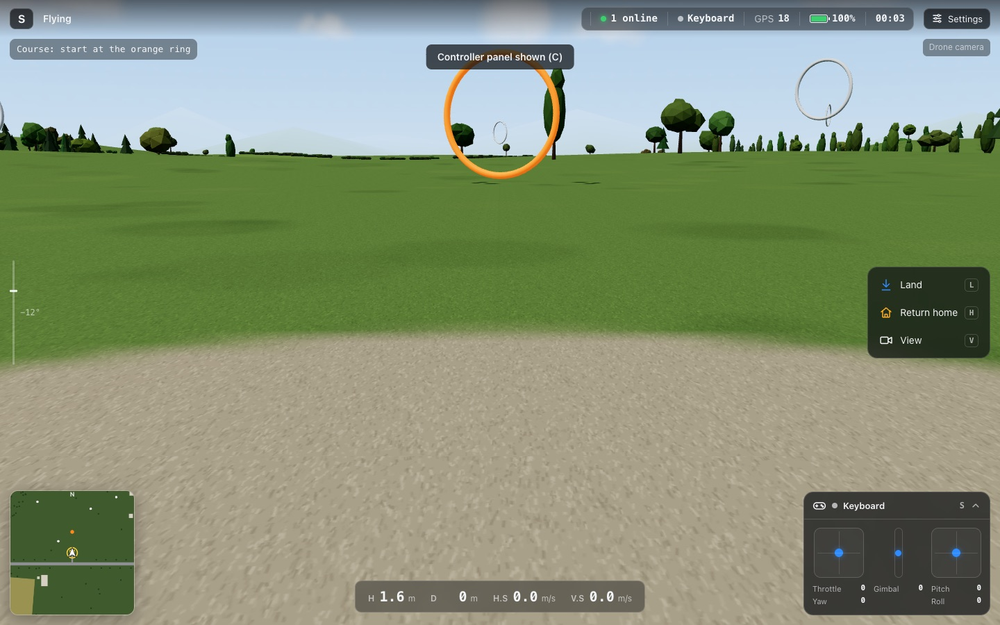
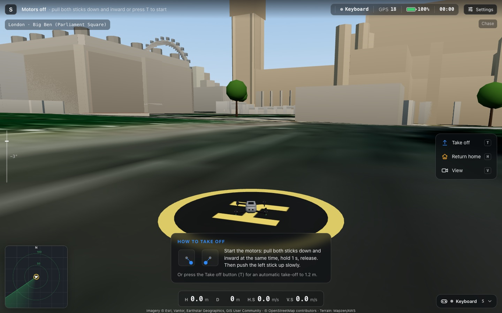
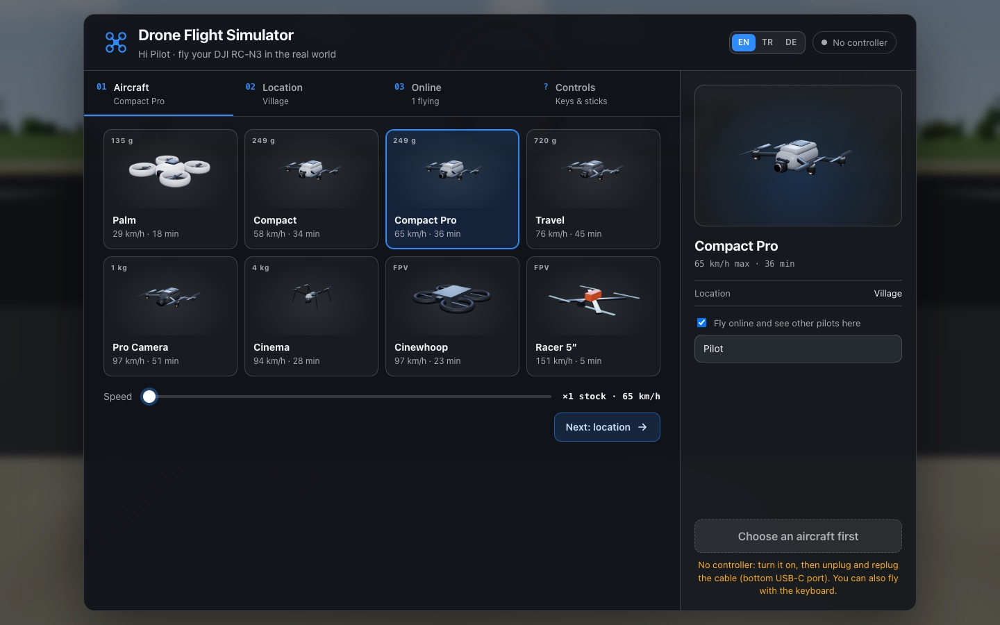
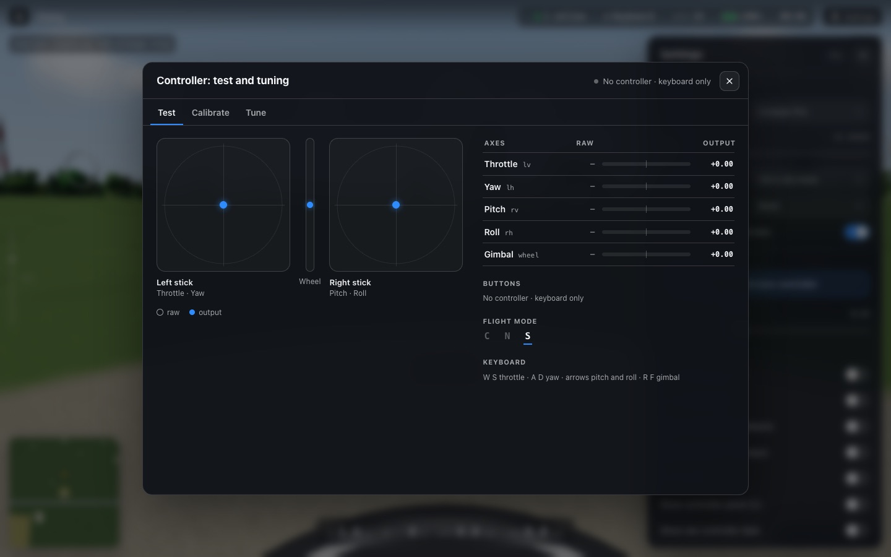

# Drone Flight Simulator

Fly a drone in your browser over real places — with a real **DJI RC-N3** remote, a gamepad, the keyboard or touch controls.


## The story

My DJI Neo crashed and was never found. The remote stayed on my desk. I wanted to keep flying, so I tried DJI's simulator app on my MacBook — it did not support my setup. So I wrote a small bridge that reads the RC-N3 over USB on macOS, and a simulator around it: Google's photorealistic 3D cities, a free satellite map, and online rooms where pilots see each other.

## Features

- **Real controller**: DJI RC-N3 over USB (macOS bridge, or Web Serial in Chrome/Edge), C/N/S flight mode switch, RTH and camera buttons. Also gamepads/RC transmitters, keyboard and on-screen touch sticks.
- **Real places**:
  - **Google 3D** — Google Photorealistic 3D Tiles (needs your own Google API key).
  - **Satellite 3D** — free: Esri satellite imagery on real terrain with OpenStreetMap buildings.
  - **Open map** — light OpenStreetMap rendering.
  - **Village** — offline practice world with an 8-ring course.
  - 38 start locations incl. the New 7 Wonders, each starting in an open spot facing the landmark; or start from your own location.
- **Flight model**: GPS-mode drones with factory speeds, C/N/S modes, position hold, auto take-off/landing, return-to-home, battery, wind; FPV drones with acro mode.
- **Online rooms**: pilots at the same place see each other; the mini map works as a radar; a lobby shows who is flying where.
- **Controller test & calibration**: live sticks, calibration wizard, per-axis deadzone/expo/rate, per-mode speed limits.
- **Recording helpers**: preload an area before recording, and a clean video mode (`U`) that hides the HUD.
- UI in **English, Turkish and German**; works on desktop, tablet and phone.

| | |
|---|---|
|  |  |
|  |  |

<sub>Satellite imagery © Esri, Vantor, Earthstar Geographics, GIS User Community · © OpenMapTiles · © OpenStreetMap contributors</sub>

## Quick start

Requirements: Python 3 (standard library only) and a WebGL browser (Safari, Chrome, Edge, Firefox). No build step.

```sh
git clone https://github.com/sewerkde/drone-flight-simulator.git
cd drone-flight-simulator
./start.sh          # or: python3 serve.py 8765 & python3 rooms.py 8766
```

Open <http://localhost:8765>. On macOS you can also double-click `baslat.command`.

### DJI RC-N3

- **macOS**: turn the remote on, then plug it into the Mac through the **bottom USB-C port**. `serve.py` finds it (USB vendor `0x2ca3`) and streams the sticks to the page. If you power-cycle the remote, unplug and replug the cable.
- **Chrome / Edge on any OS**: use the "Connect DJI RC (USB)" button (Web Serial) — no local bridge needed.
- Take-off: pull both sticks down and inward (CSC), then push the left stick up — or press **T** for auto take-off.

### Keyboard

| Key | Action |
|---|---|
| `T` / `L` / `H` | take off / land / return home |
| `W` `S` / `A` `D` | climb, descend / turn |
| arrows | forward, back, sideways |
| `R` `F` | gimbal up / down |
| `1` `2` `3` | flight mode C / N / S |
| `V` | camera view (smooth transition) |
| `C` | controller panel |
| `U` | clean video mode |
| `P` / `K` | photo / video |
| `Esc` | settings |

### Google 3D

Google 3D needs a Google Maps Platform API key with the **Map Tiles API** enabled. The app has a step-by-step guide on the location screen. The key is stored only in your browser. Google bills per 3D session (first 1,000 per month free at the time of writing).

## Project layout

```
index.html, style.css   UI
src/main.js             app glue: launcher, camera, HUD wiring, online
src/flight.js, fpv.js   flight models (GPS drones, FPV acro)
src/world*.js, osm/     worlds: village, Google 3D, OpenStreetMap / satellite
src/controllers.js …    RC bridge, Web Serial, gamepad, touch, input shaping
src/rc-setup.js         controller test & calibration screen
src/lobby.js, net.js    online lobby and rooms client
serve.py                static server + RC-N3 USB bridge (macOS, SSE at /rc)
rooms.py                WebSocket relay for online rooms (+ GET /rooms)
tools/                  model builder (Blender), test pages, unit tests
```

Code comments are mostly in Turkish. Unit tests: `node --test tools/controllers.test.mjs`.

For a public deployment serve the static files from any web server, run `rooms.py` behind a TLS proxy, and set `<meta name="rooms-url" content="wss://…">` and `<meta name="rc-bridge" content="off">` in `index.html`.

## Disclaimer

DJI, RC-N3 and Neo are trademarks of SZ DJI Technology Co., Ltd. This is an independent hobby project, not affiliated with or endorsed by DJI. The aircraft in the simulator are generic models. The RC-N3 protocol handling is based on publicly documented community work.

## License

MIT — see [LICENSE](LICENSE). Third-party libraries and data sources: [THIRD_PARTY_NOTICES.md](THIRD_PARTY_NOTICES.md).
